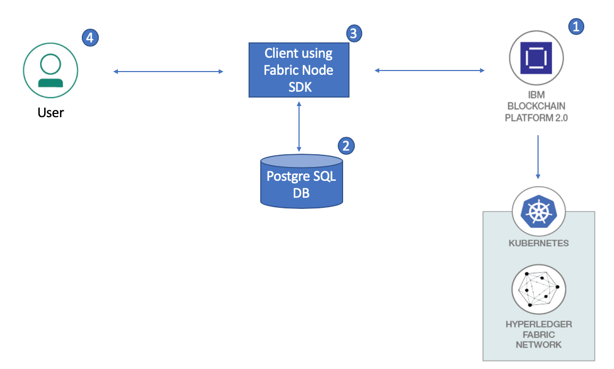
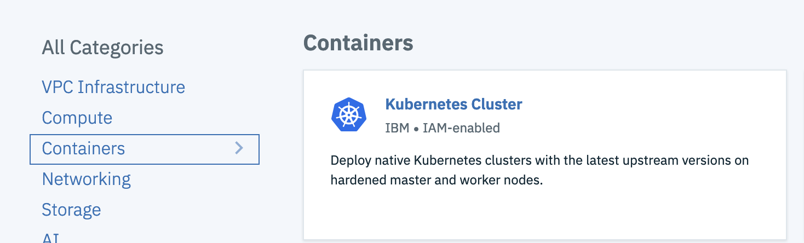
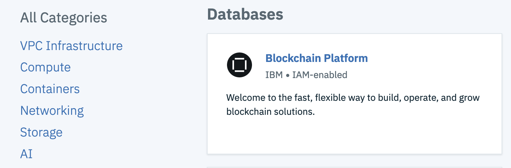
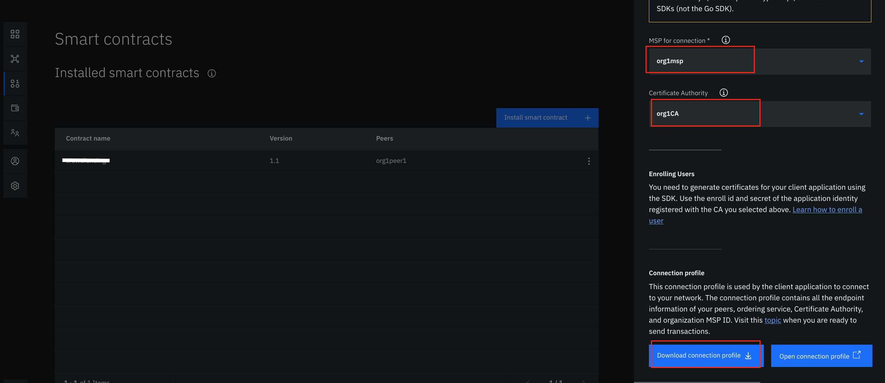
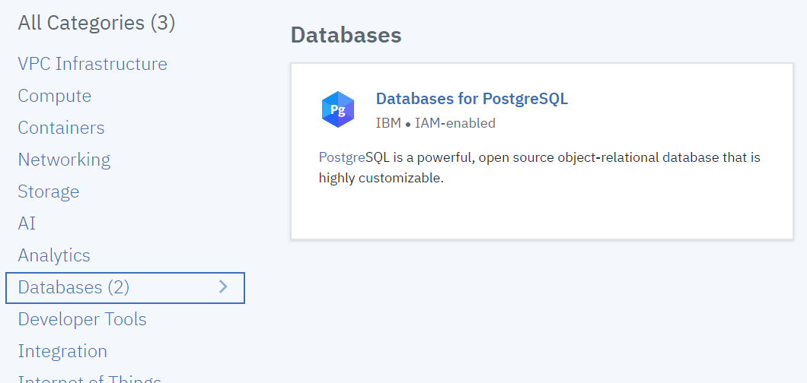
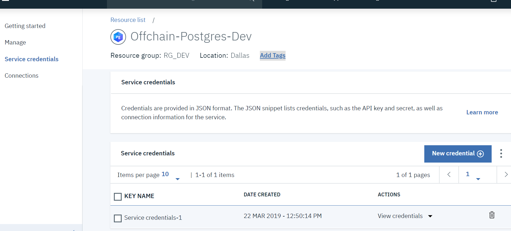
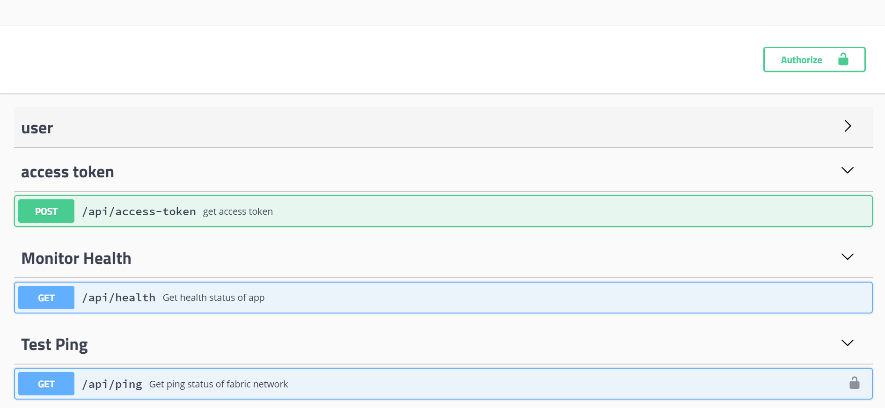
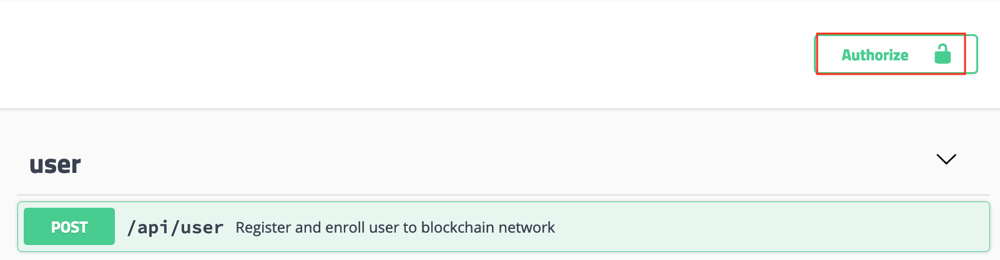

# Postgre SQL Database as a Fabric Wallet 

Security on the Hyperledger Fabric is enforced with digital signatures. All requests made to the fabric must be signed by users with appropriate enrolment certificates. Once user is enrolled, Node js application persists certificate in wallet for future usages.

There are four different types of wallet: File system, In-memory, Hardware Security Module (HSM) and CouchDB. Fabric SDK for Node.js provides default file-system wallet for storing fabric certificate. File system wallet stores user certificate in folders. Fabric Node SDK also provides a way to configure wallet in Couch DB.

But what if an user wants to use Postgres DB instead of Couch DB? There is no direct provision to store enrolment certificates to Postgres database. Postgres database support SQL and NoSQL data storing and has strong community support. This pattern demonstrates a methodology to use Postgre SQL DB as wallet using Fabric SDK for Node.js.

At the end of this code pattern, users will understand - how to use postgre sql db as a fabric certificate wallet using node js SDK.

# Flow



1. Hyperledger Fabric network is setup using IBM Blockchain Platform.
2. Configure and deploy Postgre SQL database in container. 
3. Deploy the client application using Fabric Node SDK through which user can communicate with blockchain network.
4. User will register/enroll to the blockchain network as a first step. The generated certificates will be stored in Postgre SQL DB. These certificates will be used to do further transactions with the blockchain network.


# Pre-requisites

* [IBM Cloud Account](https://cloud.ibm.com)
* [Git Client](https://git-scm.com/downloads) - needed for clone commands.
* [Node js](https://nodejs.org/en/download/) - 8.9 or greater

# Steps

Follow these steps to setup and run this code pattern. The steps are described in detail below.
1. [Get the code](#1-get-the-code)
2. [Create IBM Cloud Services](#2-create-ibm-cloud-services)
3. [Setup Hyperledger Fabric Network using IBM Blockchain Platform](#3-setup-hyperledger-fabric-network-using-ibm-blockchain-platform)
4. [Setup PostgreSQL DB](#4-setup-postgresql-db)
5. [Update connection profile and PostgreSQL credentials](#5-update-connection-profile-and-postgresql-credentials)
6. [Run the application](#6-run-the-application)
7. [API description](#7-api-description)


## 1. Get the code

- Clone the repo using the below command.
   ```
   git clone https://github.com/IBM/fabric-postgres-wallet.git
   ```

## 2. Create IBM Cloud Services

**Create IBM Kubernetes Service Instance**

Create a Kubernetes cluster with [Kubernetes Service](https://cloud.ibm.com/containers-kubernetes/catalog/cluster) using IBM Cloud Dashboard.

  

  > Note: It can take up to 15-20 minutes for the cluster to be set up and provisioned.  

**Create IBM Blockchain Platform Service Instance**

Create [IBM Blockchain Platform Service](https://cloud.ibm.com/catalog/services/blockchain-platform) instance using IBM Cloud Dashboard.



## 3. Setup Hyperledger Fabric Network using IBM Blockchain Platform

Follow this [tutorial](https://developer.ibm.com/tutorials/quick-start-guide-for-ibm-blockchain-platform/) to create fabric network using IBM Blockchain Platform. You can decide network components (number of organizations, number of peers in each org etc.) as per your requirement. For example, the blockchain network may consist of two organizations with single peer each and an orderer service for carrying out all the transactions.

**Install and instantiate the smart contract**

This code pattern can be executed with the sample chaincode [fabcar.go](https://github.com/hyperledger/fabric-samples/tree/release-1.4/chaincode/fabcar/go) or else you can install your own chaincode. Instantiate the chaincode after installation.
You can refer to step 12 to step 14 [here](https://developer.ibm.com/tutorials/quick-start-guide-for-ibm-blockchain-platform/) to install and instantiate smart contract.

**Download connection profile**

* Under `Instantiated smart contracts` section, click on the three vertical dots for your smart contract. Click on `Connect with SDK` option. 
* Provide the MSP name and Certificate Authority. Scroll down and click on `Download Connection Profile`.



* Rename the downloaded json file as `connection-profile.json`. It will be used in further steps.

## 4. Setup PostgreSQL DB

There are two approaches to set up PostgreSQL DB instance. Follow any one of those.

### Option 1 - PostgreSQL as a service on IBM Cloud 

IBM Cloud provides [PostgreSQL DB](https://cloud.ibm.com/catalog/services/databases-for-postgresql) as a service. Type postgreSQL in catalog search box on IBM Cloud Dashboard and create PostgreSQL instance.




Once service is created, navigate to left menu and create service credentials.



DB credentials will be used further in `step 5`.

### Option 2 - PostgreSQL as a Kubernetes container

To Deploy PostgreSQL on Kubernetes, ensure you are able to run `kubectl` commands properly and then follow below steps.

> Note: All scripts are available in `scripts` folder for reference. 

* **Postgres Docker Image**

   We are using PostgreSQL latest Docker image from the public registry. This image will provide the functionality of   providing custom configurations/environment variables of PostgreSQL like username, password, database name and path, etc.

* **Config Maps for PostgreSQL Configurations**

   We will be using config maps for storing PostgreSQL related information. Here, we are using the database, username and password in the config map which will be used by the PostgreSQL pod in the deployment template.

   Create Postgres config maps resource as shown.

   ```
   $ cd scripts
   $ kubectl create -f postgres-configmap.yaml 
   configmap "postgres-config" created

   ```

* **Persistent Storage Volume**

   To save the data, we will be using Persistent volumes and persistent volume claim resource within Kubernetes to store the data on persistent storages.

   Here, we are using local directory/path as Persistent storage resource `/mnt/data`

   Create storage related deployments as shown.

   ```
   $ kubectl create -f postgres-storage.yaml 
   persistentvolume "postgres-pv-volume" created
   persistentvolumeclaim "postgres-pv-claim" created
   ```

* **PostgreSQL Deployment**

   PostgreSQL manifest for deployment of PostgreSQL container uses PostgreSQL latest(or higher version 10.4) image. It is using PostgreSQL configuration like username, password, database name from the configmap that we created earlier. It also mounts the volume created from the persistent volumes and claims to make PostgreSQL container’s data persists.

   Create Postgres deployment using the below steps.

   ```
   $ kubectl create -f postgres-deployment.yaml 
   deployment "postgres" created
   ```

* **PostgreSQL Service**

   To access the deployment or container, we need to expose PostgreSQL service. Kubernetes provides different type of services like ClusterIP, NodePort and LoadBalancer.

   Create Postgres Service using the following step.

   ```
   $ kubectl create -f postgres-service.yaml 
   service "postgres" created
   ```

* **Get Connection Details for Postgres DB**

   * ***Get port of Postgre***
   
      To get port number, run command as:
      
      ```
      $ kubectl get svc postgres
      NAME       TYPE       CLUSTER-IP      EXTERNAL-IP   PORT(S)          AGE
      postgres   NodePort   *.**7.*1.*53   <none>        5432:31070/TCP   5m
      ```
      Here, 31070 is external port number for PostgreSQL service running on kubernetes cluster.

   * ***Get the public IP for Kubernetes Cluster***
 
       Once cluster is up and running then find out the public IP of your cluster. It will be required for further steps.

        a) Go to `IBM Cloud Dashboard -> Kubernetes Cluster -> <your cluster>`. It gives you details of the cluster.

        b) Access `Worker Nodes` tab, it will show you the public IP of your cluster as shown in below screenshot.
        
        
        
        Make a note of this public IP.
 
   * ***Connection details of PostgresDB***
   
      This port number and cluster public ip will be used as db connection details further in `step 5`.

   
## 5. Update connection profile and PostgreSQL credentials

After setting up fabric network and PostgreSQL DB as mentioned above, perform the following steps:

* Replace ```server/config/connection-profile.json``` with your fabric network connection profile which was downloaded in `step 3`.

* Replace your PostgreSQL credentials in ```server/config/postgres-config.json```. In case of containerised Postgres DB, replace IP and port in this json file. And in case of IBM Cloud PostgreSQL service, replace the json file content with your PostgreSQL credentials.
  
## 6. Run the application

Choose the mode of deployment and perform the steps.

**Deploy node app locally**

To run application, first install npm dependencies and run the application.

   ``` 
   npm install
   npm start
   ```
The server will start running, visit [localhost:3000](http://localhost:3000/) for api swagger.

**Deploy node app on IBM Cloud**

Deploy the application to IBM Cloud using the command:

  ```
  ibmcloud cf push
  ```
Deployment might take a few minutes to complete. Ensure that there are no errors while deploying the application.
 
Login to `IBM Cloud`. On the `Dashboard`, verify that app is running fine. Click on the web application entry. When application page opens, click on `Visit App URL` for api swagger.

## 7. API Description 
After running application, we can see swagger UI as below:



This Fabric postgres wallet provide following APIs:

* **POST user API** - This API is used for registering and enrolling user to blockchain fabric network. Once user is registered certificate is stored to Postgre wallet. Need to do the following changes to request body in order to register user to blockchain network:
```
   org - should be mapped to your network org name. 
   user - user name you wish to register
   pw  - password for user (will be used for authentication of user)
   attrs - this is custom attribute object, where you can add any custom attributes need to be added to certificate and which can be used by chaincode for ACL implementation.
```

* **GET user API** - This API will return all users saved to PostgreSQL wallet.

* **POST access-token API** - This API will return JWT token after validating username and password (which we provided while registering user in above POST user api) in PostgreSQL wallet. This token is encoded with user information which will be used to retrieve certificate from wallet while interacting with fabric network. Download/copy the access token generated through API.

* **GET monitor health API** - This API checks the health of deployed node application.

* **GET ping API** - This API will query fabric network using certificate stored in PostgreSQL wallet. To execute this api, you need to authorize first using the `Authorize` button provided in top-right corner. 

   

   Click on the `Authorize` button and provide the access-token for authentication as bearerToken copied from the output of `Access-token API`. The api will authenticate user based on token and once user is authenticated, it will decode user  information (userid, role) from token, then api will retrieve user certificate from wallet based on userid (user id is used as   key to store certificate in wallet). Fabric SDK for Node.js will use this certificate and connection profile to query/invoke chaincode. 

> Note: In this code pattern, we have installed fabcar chaincode on network, so we are calling  ```queryAllCars``` chaincode function. Please do change this as per your chaincode functions.


## Learn More

* [Quick start guide for IBM Blockchain Platform](https://developer.ibm.com/tutorials/quick-start-guide-for-ibm-blockchain-platform/)
* [PostgreSQL DB](http://www.postgresqltutorial.com/)
* [Learn more about wallets of Hyperledger Fabric](https://hyperledger-fabric.readthedocs.io/en/release-1.4/developapps/wallet.html)


<!-- keep this -->
## License

This code pattern is licensed under the Apache Software License, Version 2. Separate third-party code objects invoked within this code pattern are licensed by their respective providers pursuant to their own separate licenses. Contributions are subject to the [Developer Certificate of Origin, Version 1.1 (DCO)](https://developercertificate.org/) and the [Apache Software License, Version 2](https://www.apache.org/licenses/LICENSE-2.0.txt).

[Apache Software License (ASL) FAQ](https://www.apache.org/foundation/license-faq.html#WhatDoesItMEAN)

